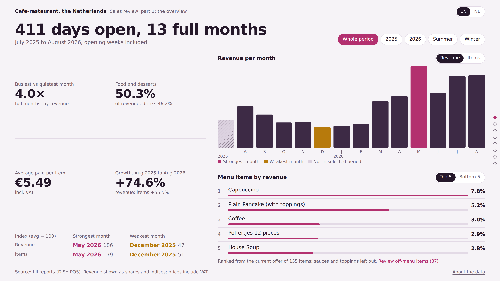
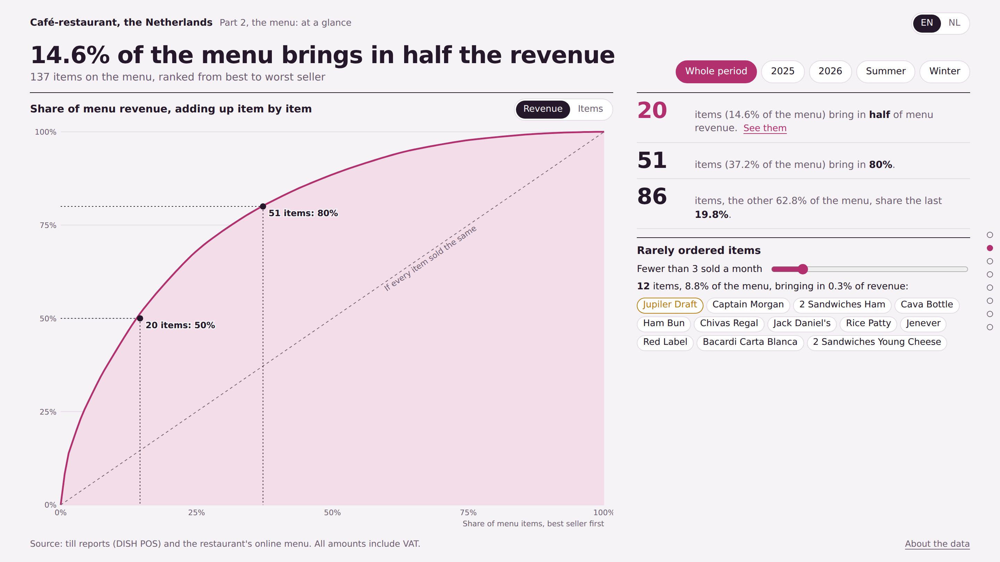
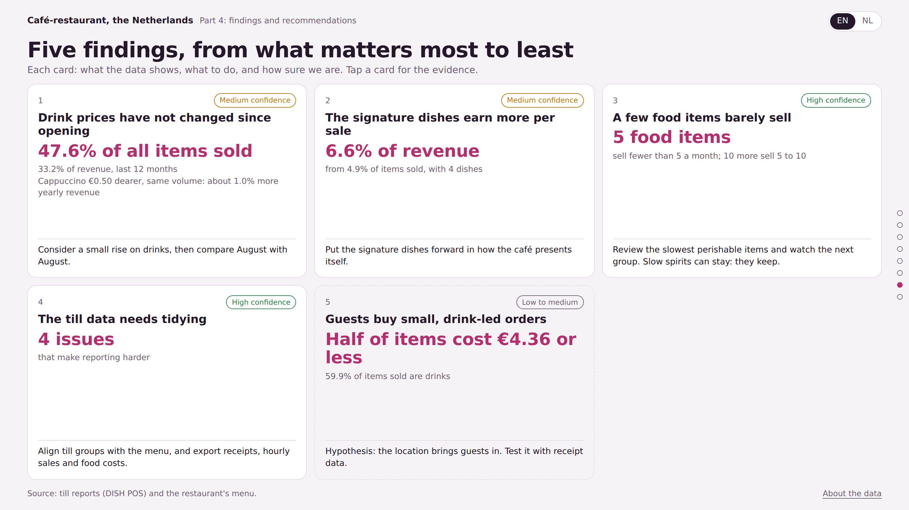
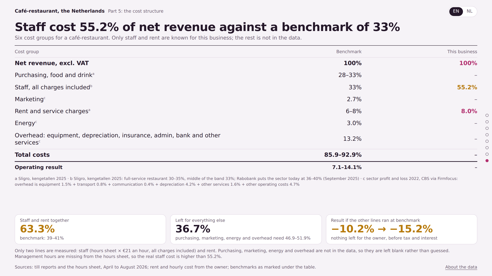

# Café-restaurant sales analysis

Thirteen months of till data from an independent café-restaurant in the Netherlands, turned
into one interactive report you can read in about ten minutes.

**[▶ Open the live report](https://sahandhaghighi.github.io/cafe-restaurant-analysis/)**

> The business is de-identified: no name, no city, no exact opening date, and the few dishes that
> would give it away are relabelled. Revenue and item counts appear only as shares, growth rates
> and index numbers, and the figures inside the file are scaled by a constant so absolute revenue
> cannot be read back from the source. Menu prices are public and shown as they are.



---

## Why

The owner had thirteen months of exports sitting in a folder and nothing built on top of them.
He knew sales were up. He did not know which items were carrying the place, whether the price
round in March had actually earned anything, or how his costs compared with the sector.

I wanted to answer those three questions from the data alone, and be clear about the ones I
could not answer at all.

## What I had to work with

| Source | What it covers |
|---|---|
| 14 monthly DISH POS sales exports | July 2025 – August 2026, ~250 till buttons |
| Article and turnover-group exports | product master data, till grouping |
| The restaurant's own hours sheet | April – August 2026, per employee per day |
| The restaurant's public menu | 137 menu lines in 10 sections |

Two things had to be sorted out before any of it was usable.

The monthly reports were exported with an end time of 06:00 on the last day of each month, so
the last day of every month is missing. I only found this by reconciling the monthly files
against the till's full-period export; it turned out to be about 3.5% of sales. Every daily
average in the report divides by the days actually covered, not by calendar days.

Then the till had roughly 250 buttons and the menu had 137 lines, and nobody had ever
reconciled the two. I mapped them by hand: a pancake and its topping are one menu line, so are
Coca-Cola and Coca-Cola Zero. Without that, every ranking in the report would have been wrong
in a way nobody would have noticed.

## What this data can and cannot tell you

This is a first-pass report on monthly, item-level sales. That is all the till exports contain,
and it sets a hard limit on the questions worth asking.

It handles revenue and volume by month, seasonality, menu concentration, performance per item
and per section, price changes inferred from the data, and a like-for-like measure of what the
price round earned.

It cannot answer these, and I did not try to fake them:

| Missing | What stays unanswered |
|---|---|
| Receipt-level data | average spend per guest, basket composition, how many guests |
| Sales per hour or per day | staffing against demand, opening-hour decisions |
| Purchase prices | margin per dish, the real profit ranking, what dropping an item is worth |
| Staff hours before April 2026 | the winter wage ratio, a full year of labour |
| Management hours | the true labour cost; what the report shows is a floor |
| Cost lines other than rent and staff | a complete profit and loss |

So assumptions are marked as assumptions, unknown cost lines are left blank instead of
estimated, and every finding carries a confidence level. The last page lists the four exports
that would close most of these gaps.

## What is in the report

1. **Overview** — revenue, items and seasonality across 13 months, with period filters.
2. **The menu** — Pareto concentration, section and item performance, and a drill-down for each
   of the 137 menu lines.
3. **Pricing** — the price rounds, what the March 2026 round actually earned, a check on whether
   guests bought less afterwards, and a calculator for the items whose price never moved.
4. **Findings** — six findings, ranked, each with its evidence, an action and a confidence level.
5. **Staff hours** — wage cost against net revenue, revenue and staff cost per opening hour, and
   the shape of the working week.
6. **Cost structure** — the two cost lines that are actually known, against published benchmarks.



## What came out of it

**The drinks were never repriced.** In March 2026, 100 items went up and the drinks stayed
where they were. Those drinks are close to half of everything the place sells.

**The price round worked.** April to August 2026 ran 7.8% above what the same items would have
brought in at February prices. And comparing August to August, the only month open in both
years, the items that went up grew *faster* (+46.8%) than the ones that did not (+35.5%). So
there is no sign guests walked away from the higher prices.

**Four dishes punch above their weight.** They take a share of revenue well above their share
of items sold.

**The menu is far more concentrated than the owner thought.** 14.6% of it brings in half the
revenue. Eighty-six items split the last 19.8% between them, and twelve food items sell fewer
than three a month.

**Staff cost is the real constraint.** Wages including all employer charges run far above the
sector norm. Once staff and rent are paid, a third of net revenue is left for purchasing,
energy, marketing and everything else combined. The benchmarks say those need around half.



## How the numbers were produced

Everything is computed from the raw exports. Nothing is typed in by hand.

The price rounds are not given anywhere in the data; I inferred them. Revenue divided by items
sold, per till button per month, gives the average price paid, and the month that sits between
two price levels is the month the price changed.

The price effect is deliberately like-for-like: the same items at their February 2026 price. New
items and menu changes do not get to inflate it.

Cost benchmarks are cited line by line, not lumped together (Sligro *kengetallen 2025*,
Rabobank September 2025, CBS sector figures via Firmfocus).



## The report itself

One HTML file. No build step, no dependencies, no tracking. Each section is exactly one screen
tall and snaps to the next. It works on a phone, follows your light or dark setting, and
switches between English and Dutch. The charts are inline SVG, written by hand, because a
charting library would have been heavier than the whole report.

## Repository

```
index.html                 the report; open it in any browser
screenshot-*.png           stills used in this README
```

The till exports are the business's own data and are not published here.

## Tools

Python (pandas, openpyxl) for the analysis, plain HTML/CSS/JS for the report, Playwright to
screenshot every page at two screen sizes in both languages and catch layout breaks before
they shipped.

---

*Sahand Haghighi — business analyst, eight years in retail and e-commerce, now in the
Netherlands. [LinkedIn](https://www.linkedin.com/in/sahand-haghighi/)*
